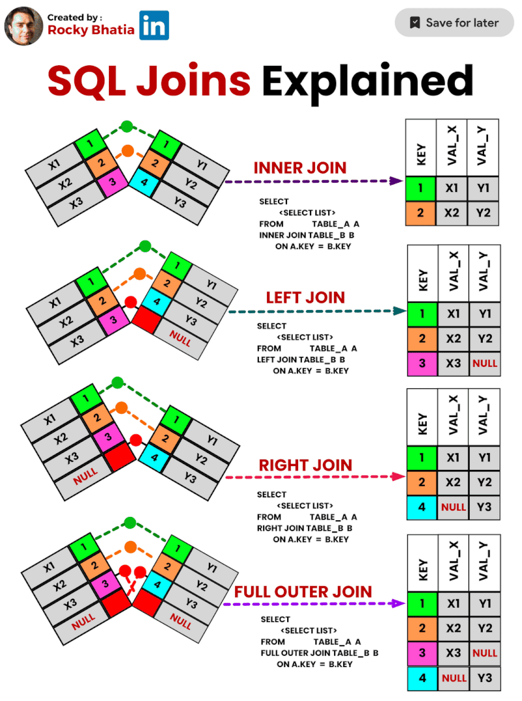

# Data Engineer

## SQL

- [Общий вид паттерна SQL конструкции, последовательность выполнения шагов запроса](#sql-pattern-overview)
- [Операции DML, DDL, DCL и TCL](#sql-operations)
- [Работа со множествами (UNION, EXCEPT, INTERSECT, IN, NOT IN)](#sql-set-operations)
- [Работа с фильтрами, базовые условные операторы, операторы EXISTS, IN, LIKE](#sql-filters-and-operators)
- [Что такое JOIN и какие виды бывают](#sql-joins)
- [Ограничение выборки - LIMIT, OFFSET](#sql-limit-and-offset)
- [Транзакции и как с ними работать](#sql-transactions)

## Python

- [Базовый синтаксис Python](#python-basic-syntax)
- [Объявление переменных, операторы и выражения](#python-variables-and-operators)
- [Базовые типы данных (Numbers, Strings, Booleans)](#python-basic-data-types)
- [Работа с комплексными структурами. Списки и массивы (Lists, Tuples, Dictionaries)](#python-complex-data-structures)
- [Функции, модульное программирование](#python-functions-and-modular-programming)
- [Изменяемость и неизменяемость типов данных](#python-mutability)
- [Декораторы](#python-decorators)
- [Работа с исключениями, блок try/except/else/finally](#python-exception-handling)
- [Контекстные менеджеры и практика работы с ними](#python-context-managers)
- [Итераторы и генераторы, отличия и практика работы с этими объектами](#python-iterators-and-generators)

## Overall IT

- [Алгоритмы и структуры данных](#algorithms-and-data-structures)

---

# SQL Questions and Answers

## SQL Pattern Overview

SQL конструкции следуют стандартному паттерну:

1. `SELECT` — выбрать колонки.
2. `FROM` — указать таблицу(ы).
3. `JOIN` — объединение данных из нескольких таблиц.
4. `WHERE` — фильтрация строк.
5. `GROUP BY` — группировка строк.
6. `HAVING` — фильтрация групп.
7. `ORDER BY` — сортировка результата.
8. `LIMIT/OFFSET` — ограничение результата.

   SQL выполняется в следующем порядке: `FROM` → `JOIN` → `WHERE` → `GROUP BY` → `HAVING` → `SELECT` → `ORDER BY` → `LIMIT`.

## SQL Operations

- **DML (Data Manipulation Language):** операции для работы с данными (`SELECT`, `INSERT`, `UPDATE`, `DELETE`).
- **DDL (Data Definition Language):** создание и изменение структуры базы данных (`CREATE`, `ALTER`, `DROP`).
- **DCL (Data Control Language):** управление доступом к данным (`GRANT`, `REVOKE`).
- **TCL (Transaction Control Language):** управление транзакциями (`BEGIN`, `COMMIT`, `ROLLBACK`).

<div align="center">
  
</div>

## SQL Set Operations

- **UNION:** объединяет результаты двух запросов, исключая дубли.
- **EXCEPT:** возвращает строки из первого запроса, которых нет во втором.
- **INTERSECT:** возвращает строки, общие для обоих запросов.
- **IN/NOT IN:** проверяет наличие значения в списке (`IN`) или его отсутствие (`NOT IN`).

## SQL Filters and Operators

- **Фильтры (`WHERE`):** позволяют ограничить строки, соответствующие условиям.
- **Операторы:**
  - `=` — равно.
  - `<`, `>`, `<=`, `>=` — сравнение.
  - `BETWEEN` — диапазон.
  - `EXISTS` — проверяет наличие строк в подзапросе.
  - `LIKE` — поиск по шаблону (`%` — любые символы, `_` — один символ).
  - `IN` — проверка принадлежности значений.

## SQL Joins

`JOIN` объединяет строки из разных таблиц.

Виды:

- **INNER JOIN:** возвращает совпадающие строки.
- **LEFT JOIN:** все строки из левой таблицы + совпадения.
- **RIGHT JOIN:** все строки из правой таблицы + совпадения.
- **FULL OUTER JOIN:** объединение всех строк из обеих таблиц.
- **CROSS JOIN:** декартово произведение (все комбинации строк).

<div align="center">
  
</div>

<div align="center">
  
</div>

## SQL Limit and Offset

- **LIMIT:** ограничивает количество строк в результате (`LIMIT 10` — первые 10 строк).
- **OFFSET:** пропускает указанное количество строк перед выборкой (`OFFSET 5` — пропустить первые 5 строк).

  Комбинация `LIMIT` и `OFFSET` позволяет реализовать пагинацию (`LIMIT 10 OFFSET 20` — строки с 21 по 30).

## SQL Transactions

Транзакция — это единица работы с данными, которую можно подтвердить (`COMMIT`) или откатить (`ROLLBACK`).

Пример работы:

1. `BEGIN TRANSACTION;` — начать транзакцию.
2. Выполнить изменения (`INSERT`, `UPDATE`, `DELETE`).
3. `COMMIT;` — подтвердить изменения.
4. Если ошибка, выполнить `ROLLBACK;` — откатить изменения.

   Транзакции обеспечивают целостность данных и поддерживают свойства ACID: атомарность, согласованность, изоляция, долговечность.

---

# Python Questions and Answers

## Python Basic Syntax

Python отличается лаконичным и читаемым синтаксисом. Основные правила:

- Используются **отступы** вместо фигурных скобок для обозначения блоков кода (рекомендуемый отступ — 4 пробела).
- Код чувствителен к регистру (`Name` и `name` — разные переменные).
- Пример:
  ```python
  x = 10  # Объявление переменной
  if x > 0:
      print("Positive")
  else:
      print("Non-positive")
  ```

## Python Variables and Operators

- **Переменные** создаются присваиванием значений. Объявление типа не требуется (Python — язык с динамической типизацией).
  ```python
  name = "Alice"  # строка
  age = 25        # число
  is_student = True  # логическое значение
  ```
- **Операторы**:
  - Арифметические: `+` (сложение), `-` (вычитание), `*` (умножение), `/` (деление), `//` (целочисленное деление), `%` (остаток), `**` (возведение в степень).
  - Сравнения: `==` (равно), `!=` (не равно), `<`, `>`, `<=`, `>=`.
  - Логические: `and`, `or`, `not`.
  - Присваивания: `=`, `+=`, `-=`, `*=`, `/=`.

Пример:

```python
x = 5
y = 3
print(x + y)  # 8
print(x > y and y > 0)  # True
```

## Python Basic Data Types

Python поддерживает следующие основные типы данных:

- **Numbers:**
  - `int` — целые числа (например, `42`).
  - `float` — числа с плавающей точкой (например, `3.14`).
  - `complex` — комплексные числа (например, `1+2j`).
- **Strings (строки):** текстовые данные, заключённые в одинарные или двойные кавычки.
  ```python
  s = "Hello, World!"
  print(len(s))  # длина строки
  print(s.upper())  # HELLO, WORLD!
  ```
- **Booleans:** логические значения `True` и `False`.

## Python Complex Data Structures

### Списки (Lists)

- Изменяемые упорядоченные коллекции.
- Методы: `.append()`, `.remove()`, `.pop()`, `.sort()`, `.reverse()`.

```python
lst = [1, 2, 3]
lst.append(4)  # [1, 2, 3, 4]
lst.pop()      # [1, 2, 3]
```

### Кортежи (Tuples)

- Неизменяемые упорядоченные коллекции.

```python
tup = (1, 2, 3)
print(tup[0])  # 1
```

### Словари (Dictionaries)

- Хранение данных в формате ключ-значение.
- Методы: `.keys()`, `.values()`, `.items()`.

```python
dct = {"name": "Alice", "age": 30}
dct["city"] = "New York"  # Добавление
print(dct["name"])        # Alice
```

## Python Functions and Modular Programming

Функции определяются с помощью `def` и используются для повторного выполнения кода:

```python
def greet(name):
    return f"Hello, {name}!"

print(greet("Alice"))  # Hello, Alice!
```

Модули организуют код по файлам. Их можно импортировать:

```python
import math
print(math.sqrt(16))  # 4.0
```

## Python Mutability

- **Изменяемые (mutable):** можно изменять содержимое объекта (`list`, `dict`, `set`).
  ```python
  lst = [1, 2, 3]
  lst.append(4)  # [1, 2, 3, 4]
  ```
- **Неизменяемые (immutable):** содержимое объекта нельзя изменить (`int`, `str`, `tuple`).
  ```python
  name = "Alice"
  name[0] = "B"  # Ошибка
  ```

## Python Decorators

- Декораторы — это функции, изменяющие поведение других функций.

  Пример:

```python
def decorator(func):
    def wrapper():
        print("Before")
        func()
        print("After")
    return wrapper

@decorator
def say_hello():
    print("Hello")

say_hello()
```

## Python Exception Handling

Исключения обрабатываются для предотвращения сбоев программы:

```python
try:
    x = 1 / 0
except ZeroDivisionError:
    print("Cannot divide by zero")
else:
    print("No errors")
finally:
    print("Always executed")
```

## Python Context Managers

Контекстные менеджеры автоматически управляют ресурсами, например, файлами.

Пример:

```python
with open("file.txt", "r") as file:
    content = file.read()
print(content)  # Файл автоматически закрывается
```

## Python Iterators and Generators

### Итераторы

Итераторы — объекты, которые возвращают элементы по одному.

```python
lst = [1, 2, 3]
it = iter(lst)
print(next(it))  # 1
print(next(it))  # 2
```

### Генераторы

Генераторы создаются с использованием `yield` для ленивой генерации данных.

```python
def generator():
    for i in range(3):
        yield i

for value in generator():
    print(value)
```

Генераторы экономят память, создавая элементы по мере необходимости.

---

# Общий IT Раздел

## Algorithms and Data Structures

### Алгоритмы

Алгоритмы — это последовательности инструкций для выполнения задачи. Они являются основой программирования и служат для решения различных задач. Ключевые характеристики алгоритмов:

1. **Точность:** чёткое определение шагов.
2. **Конечность:** выполнение за конечное число шагов.
3. **Эффективность:** минимизация использования времени и памяти.

#### Основные виды алгоритмов:

1. **Сортировка:**

   - **Bubble Sort:** простая, но медленная сортировка путём многократного сравнения соседних элементов.
   - **Merge Sort:** делит массив на части, сортирует их и объединяет.
   - **Quick Sort:** использует разделение массива на меньшие части вокруг опорного элемента.

2. **Поиск:**

   - **Линейный поиск:** проверяет каждый элемент массива.
   - **Бинарный поиск:** ищет в отсортированном массиве, деля его пополам.

3. **Графовые алгоритмы:**

   - **Поиск в ширину (BFS):** проходит по уровням графа.
   - **Поиск в глубину (DFS):** уходит в глубину графа, пока возможно.

4. **Жадные алгоритмы:** выбирают локально оптимальное решение на каждом шаге (например, алгоритм Дейкстры: используется для нахождения кратчайшего пути от одной вершины до всех остальных в графе с неотрицательными весами рёбер.).

5. **Динамическое программирование:** разбивает задачу на подзадачи, запоминая их решения (например, задача о рюкзаке(Knapsack Problem) — это оптимизационная задача, в которой нужно выбрать набор предметов для размещения в рюкзаке, чтобы максимизировать их ценность, не превышая ограничение по весу.).

#### Пример: Бинарный поиск

```python
def binary_search(arr, target):
    left, right = 0, len(arr) - 1
    while left <= right:
        mid = (left + right) // 2
        if arr[mid] == target:
            return mid
        elif arr[mid] < target:
            left = mid + 1
        else:
            right = mid - 1
    return -1
```

### Структуры данных

Структуры данных — это способы организации и хранения данных для эффективной работы алгоритмов.

#### Основные типы структур данных:

1. **Массивы (Arrays):** упорядоченные коллекции элементов одного типа.

   - Доступ к элементам по индексу за O(1).
   - Добавление/удаление элемента — O(n).

2. **Списки (Linked Lists):** последовательности элементов, где каждый элемент хранит ссылку на следующий.

   - Быстрое добавление/удаление в начало/конец.
   - Медленный доступ к элементам (O(n)).

3. **Стеки (Stacks):** работают по принципу LIFO (последним пришёл — первым вышел).

   - Операции `push`, `pop`, `peek`.

   ```python
   stack = []
   stack.append(1)  # push
   stack.pop()      # pop
   ```

4. **Очереди (Queues):** работают по принципу FIFO (первым пришёл — первым вышел).

   - Реализация через списки или `collections.deque`.

5. **Хэш-таблицы (Hash Tables):** ключ-значение, обеспечивающие быстрый доступ (O(1) в среднем).

   ```python
   d = {"key": "value"}
   print(d["key"])  # value
   ```

6. **Деревья (Trees):** иерархические структуры.

   - **Бинарное дерево поиска (BST):** узлы меньше корня — слева, больше — справа.

7. **Графы (Graphs):** узлы (вершины), соединённые рёбрами.
   - Направленные/ненаправленные, взвешенные/невзвешенные.

#### Пример: Обход графа в ширину (BFS)

```python
from collections import deque

def bfs(graph, start):
    visited = set()
    queue = deque([start])
    while queue:
        node = queue.popleft()
        if node not in visited:
            visited.add(node)
            queue.extend(graph[node] - visited)
    return visited

graph = {
    "A": {"B", "C"},
    "B": {"A", "D", "E"},
    "C": {"A", "F"},
    "D": {"B"},
    "E": {"B", "F"},
    "F": {"C", "E"}
}
print(bfs(graph, "A"))  # {'A', 'B', 'C', 'D', 'E', 'F'}
```

### Выбор структуры данных

При выборе структуры данных важно учитывать:

1. **Тип операции:** частота доступа, добавления или удаления данных.
2. **Объём данных:** влияние на производительность.
3. **Сложность операций:** временная сложность.

### Анализ алгоритмов (Big O)

**Big O notation** описывает сложность алгоритма:

- O(1): Константное время (наиболее эффективное).
- O(n): Линейное время (увеличивается пропорционально входным данным).
- O(n^2): Квадратичное время (часто для вложенных циклов).
- O(log n): Логарифмическое время (например, бинарный поиск).

#### Пример анализа:

- Линейный поиск массива: O(n).
- Вставка в хэш-таблицу: O(1) в среднем.
- Сортировка слиянием: O(n log n).
